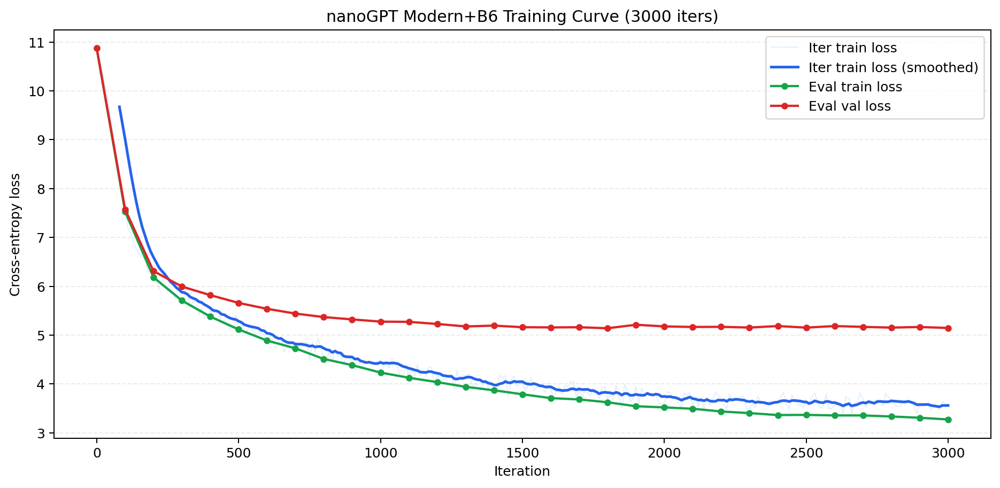
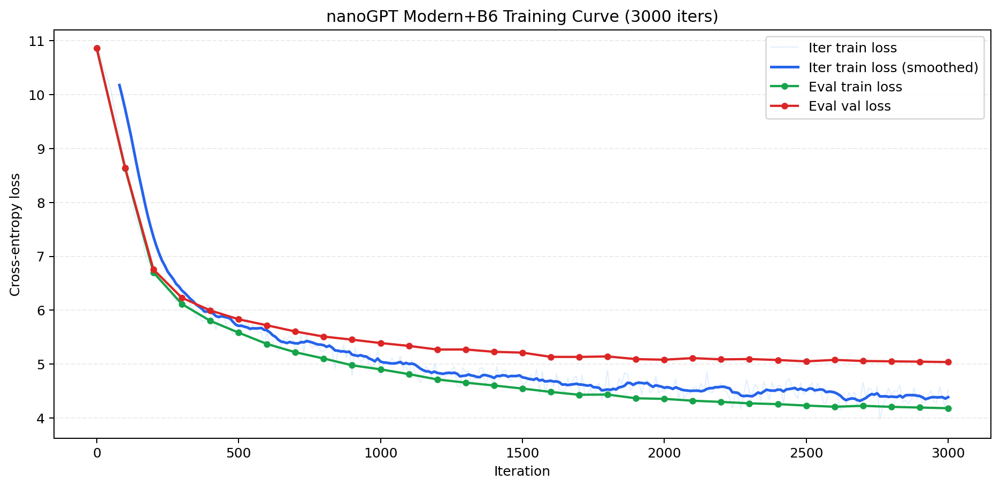

# Figure Gallery

> Date: 2026-06-11  
> Dataset: WikiText-2 raw v1  
> Evaluation: unified full-split evaluation

这个文件专门集中展示项目里的主要对比图，方便检查结果、写报告和做展示。

## 1. Task A: Baseline Comparison

Task A 统一了数据和评估方式，比较了 3-gram、LSTM 和 nanoGPT 14M。

### Perplexity


### Loss


### LSTM Training Curve


### nanoGPT Training Curve

下面三张图来自重新训练的 3000 iters 日志，用于展示 default nanoGPT 和最终 `Modern+B6` 的 train/val loss 变化。注意，这些曲线用于观察训练趋势；最终主结果仍以 6000 iters 的 full-split evaluation 为准。

#### Default nanoGPT



#### Modern+B6 nanoGPT



#### Default vs Modern+B6


## 2. Task B: Hyperparameter Tuning

Task B 比较了不同 learning rate、dropout 和 block size。最好的配置是 B6。


关键结论：

```text
B6 = lr=3e-4, dropout=0.2, block_size=256
```

## 3. Task C: Architecture and LoRA Ablation

Task C 比较了 RoPE、RMSNorm、SwiGLU、LoRA 以及组合后的 Modern 架构。


关键结论：

```text
RoPE is the strongest single architecture change.
Modern = RoPE + RMSNorm + SwiGLU is the best C-only variant.
```

## 4. Final Comparison

最终模型是 Modern 架构和 B6 超参数的组合：

```text
Modern+B6 = RoPE + RMSNorm + SwiGLU
          + lr=3e-4
          + dropout=0.2
          + block_size=256
```

### Final Perplexity


### Final Loss


## 5. Final Result Table

| Model | Val PPL ↓ | Test PPL ↓ |
|---|---:|---:|
| 3-gram | 1331.93 | 1359.86 |
| LSTM | 245.59 | 260.11 |
| nanoGPT 14M default | 176.29 | 183.99 |
| nanoGPT B6 tuned | 155.59 | 162.14 |
| nanoGPT Modern | 155.50 | 164.72 |
| **nanoGPT Modern+B6** | **134.29** | **142.15** |

最终推荐汇报模型：

```text
nanoGPT 14M Modern+B6
```
