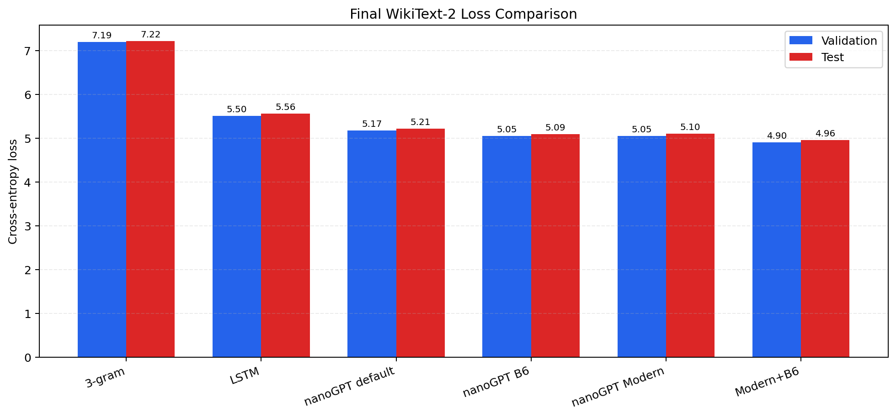

# Final Report Draft

> Project: Reproduction and Optimization of nanoGPT  
> Dataset: WikiText-2 raw v1  
> Tokenizer: GPT-2 BPE  
> Final model: nanoGPT 14M Modern+B6

## 1. Overview

This project reproduces a small GPT-style language model based on nanoGPT and evaluates it against traditional and neural baselines under a unified WikiText-2 setup. The project emphasizes fair comparison, systematic hyperparameter tuning, and architecture ablation rather than scaling to full GPT-2 pretraining.

The final pipeline consists of:

```text
Unified data/evaluation -> Baseline comparison -> Hyperparameter tuning -> Architecture ablation -> Combined final model
```

## 2. Unified Experimental Setup

All models use the same shared data:

```text
data/wikitext2/{train,val,test}.bin
```

The data is WikiText-2 raw v1 tokenized with GPT-2 BPE. The final metrics are computed by:

```text
eval/eval_lm.py
```

Metrics:

```text
PPL = exp(loss)
BPC = loss / ln(2)
```

Important note: training logs report random-batch validation estimates, while final tables use full-split sequential evaluation from `eval/eval_lm.py`. Therefore, training-log best validation loss and final full-split validation loss may differ slightly.

## 3. Baselines

| Model | Params | Val PPL ↓ | Test PPL ↓ | Role |
|---|---:|---:|---:|---|
| 3-gram | - | 1331.93 | 1359.86 | Statistical baseline |
| LSTM | 13.92M | 245.59 | 260.11 | Neural baseline |
| nanoGPT 14M default | 14.28M | 176.29 | 183.99 | Reproduction baseline |

The baseline comparison shows that the GPT-style Transformer is substantially stronger than both the statistical N-gram model and the parameter-matched LSTM baseline.

## 4. Hyperparameter Tuning

Task B explored learning rate, dropout, and block size. The best hyperparameter setting was B6:

```text
learning_rate = 3e-4
min_lr = 3e-5
dropout = 0.2
block_size = 256
```

Result:

| Model | Val PPL ↓ | Test PPL ↓ |
|---|---:|---:|
| nanoGPT 14M default | 176.29 | 183.99 |
| nanoGPT B6 tuned | 155.59 | 162.14 |

Task B figure:


The key finding is that `block_size=256` is better matched to WikiText-2 than `block_size=512`, improving generalization and reducing training time.

## 5. Architecture Ablation and LoRA

Task C implemented:

| Method | Description |
|---|---|
| RoPE | Rotary position embedding |
| RMSNorm | RMS normalization |
| SwiGLU | Gated feed-forward network |
| LoRA | Low-rank adapter training |

Architecture ablation:

| Variant | Val PPL ↓ | Test PPL ↓ |
|---|---:|---:|
| Default architecture | 178.32 | 186.64 |
| RMSNorm | 177.24 | 184.93 |
| SwiGLU | 176.22 | 183.25 |
| LoRA attention r8 | 174.27 | 182.41 |
| RoPE | 162.65 | 173.08 |
| Modern: RoPE + RMSNorm + SwiGLU | 155.50 | 164.72 |

Task C figure:


The strongest single architectural change is RoPE. The strongest C-only configuration is the Modern architecture.

## 6. Final Combined Model

The final model combines the best training recipe from Task B and the best architecture recipe from Task C:

```text
Modern+B6 = RoPE + RMSNorm + SwiGLU
          + learning_rate=3e-4
          + dropout=0.2
          + block_size=256
```

Final result:

| Model | Params | Val Loss ↓ | Val PPL ↓ | Test Loss ↓ | Test PPL ↓ |
|---|---:|---:|---:|---:|---:|
| nanoGPT 14M default | 14.28M | 5.1721 | 176.29 | 5.2149 | 183.99 |
| nanoGPT B6 tuned | 14.28M | 5.0472 | 155.59 | 5.0885 | 162.14 |
| nanoGPT Modern | 14.28M | 5.0466 | 155.50 | 5.1043 | 164.72 |
| **nanoGPT Modern+B6** | **14.28M** | **4.9000** | **134.29** | **4.9569** | **142.15** |

Final figures:




Training-curve diagnostic:


This 3000-iteration training curve is used only to compare optimization behavior. The final model ranking still uses the 6000-iteration checkpoints and full-split evaluation.

## 7. Qualitative Samples

Fixed-prompt samples are stored in:

```text
eval/fixed_samples_unified.txt
```

The qualitative samples show that N-gram models quickly collapse into local loops, LSTM captures WikiText-style headings and topics but repeats separator patterns, and nanoGPT produces more document-like continuations. The final model's main strength is measured by loss/PPL rather than fully polished open-ended generation, which is expected for small-data from-scratch training.

## 8. Final Improvements

Modern+B6 vs default nanoGPT:

```text
Val PPL:  176.29 -> 134.29  = 23.8% reduction
Test PPL: 183.99 -> 142.15  = 22.7% reduction
```

Modern+B6 vs LSTM:

```text
Val PPL:  245.59 -> 134.29  = 45.3% reduction
Test PPL: 260.11 -> 142.15  = 45.4% reduction
```

## 9. Limitations

1. WikiText-2 is small, so overfitting appears quickly for larger or longer-context models.
2. The final Modern+B6 result is currently single-seed. Task B shows B6 is stable across seeds, but Modern+B6 would benefit from one additional seed if time allows.
3. The model is trained from scratch on a small dataset, so generation quality still shows repetition.
4. LoRA was tested only in an attention-only rank-8 setting.

## 10. Conclusion

The project demonstrates a clear progression from fair baseline reproduction to systematic optimization. After unifying data and evaluation, the default nanoGPT 14M already outperforms N-gram and LSTM baselines. Hyperparameter tuning reveals that a shorter context length and stronger dropout improve WikiText-2 generalization. Architecture ablation shows that RoPE is the most important single architectural change, and RoPE + RMSNorm + SwiGLU gives the strongest architecture-only result.

Combining the best hyperparameters with the best architecture gives the final nanoGPT Modern+B6 model, which achieves `134.29` validation PPL and `142.15` test PPL. This is the strongest result in the project and should be used as the final reported model.
