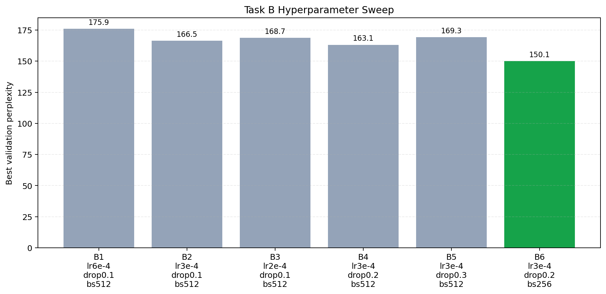
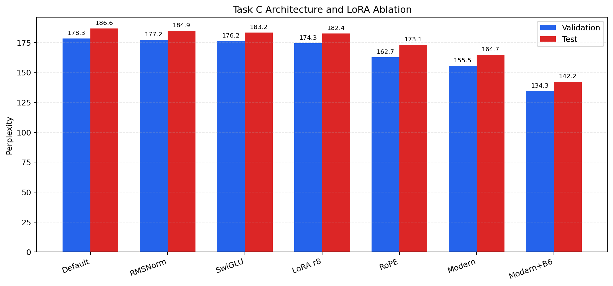
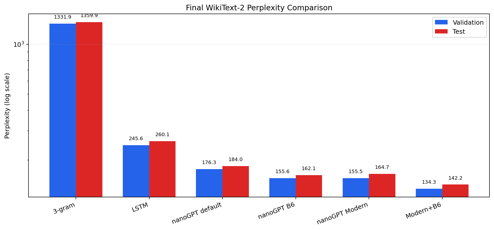
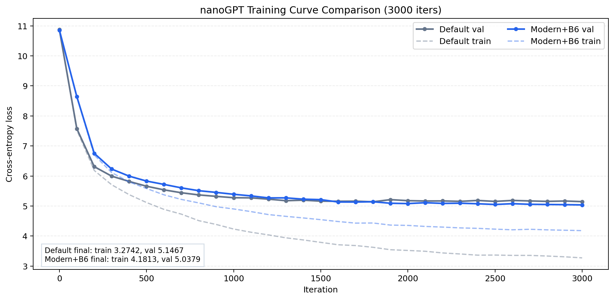

# Reproducing and Improving a 14M-Parameter GPT-Style Language Model on WikiText-2

**Anonymous CS182 Project Report**  
**Codebase:** `Reproduction-of-GPT-2`  
**Dataset:** WikiText-2 raw v1  
**Tokenizer:** GPT-2 BPE  
**Final model:** nanoGPT 14M Modern+B6

## Abstract

This project reproduces and improves a compact GPT-style language model on WikiText-2 under limited compute. We began with a practical but important issue: different parts of the repository used different WikiText-2 preprocessing outputs, which made the original baseline comparison unreliable. After consolidating all models onto one shared GPT-2 BPE token stream, we evaluated a statistical 3-gram model, a parameter-matched LSTM, and a 14M-parameter nanoGPT baseline with the same full-split evaluation script. The corrected baseline results show that the default nanoGPT model substantially outperforms both the 3-gram and LSTM baselines, reaching validation/test perplexities of 176.29/183.99 compared with the LSTM's 245.59/260.11.

We then improved the nanoGPT baseline along two axes. First, we tuned optimization hyperparameters and found that a lower learning rate, stronger dropout, and shorter context length are better matched to WikiText-2. The best tuned configuration, B6, uses `lr=3e-4`, `dropout=0.2`, and `block_size=256`, improving full-split validation/test perplexity to 155.59/162.14. Second, we implemented architectural variants including RoPE, RMSNorm, SwiGLU, and attention-only LoRA. RoPE gave the largest single architectural gain, and the combined Modern architecture, RoPE + RMSNorm + SwiGLU, reached 155.50/164.72 validation/test perplexity. Finally, combining the best hyperparameters with the best architecture produced our strongest model, nanoGPT Modern+B6, with validation/test perplexities of **134.29/142.15**. This corresponds to a 23.8% validation perplexity reduction over the default nanoGPT and a 45.3% reduction over the LSTM baseline. Beyond the final number, the main lesson is that small language-model reproduction is highly sensitive to data consistency, context length, and positional encoding.

## 1. Introduction

Large language models are often discussed at scales that are unrealistic for a course project, but many of the same engineering questions already appear in small-scale reproduction. Are the baselines evaluated on exactly the same data? Does increasing context length always help? Which modern Transformer changes matter when the model is only about 14M parameters? Can parameter-efficient adaptation compete with full model training in a small-data regime?

Our project studies these questions by reproducing and improving a GPT-style language model based on nanoGPT on WikiText-2. The goal is not to match GPT-2 pretraining scale, but to build a fair and reproducible experimental pipeline where different model families and architecture choices can be compared under one protocol. The final system includes:

```text
unified data -> unified evaluation -> baseline reproduction
             -> hyperparameter tuning -> architecture ablation
             -> combined final model
```

The most valuable part of the project was not a single training run, but the process of making the comparison trustworthy. Early in the project, we discovered that the LSTM, N-gram, and nanoGPT components were not using the same preprocessed WikiText-2 files. The token counts differed because one pipeline inserted GPT-2 end-of-text tokens per non-empty document, another joined HuggingFace rows with double newlines, and nanoGPT used its own standard token stream. These differences were large enough to affect reported loss and perplexity. We therefore moved the project to a shared data folder, `data/wikitext2`, and reran the relevant baselines.

Our contributions are:

1. We unified WikiText-2 preprocessing and evaluation across 3-gram, LSTM, and nanoGPT baselines.
2. We reproduced a 14M nanoGPT model and compared it against a similarly sized LSTM.
3. We performed a systematic hyperparameter sweep over learning rate, dropout, and context length.
4. We implemented and evaluated RoPE, RMSNorm, SwiGLU, and LoRA in the nanoGPT codebase.
5. We combined the best training recipe and architecture into a final model that gives the best project result.

## 2. Data and Evaluation Protocol

### 2.1 Dataset

All final results use WikiText-2 raw v1 tokenized with the GPT-2 BPE tokenizer. The shared data lives in:

```text
data/wikitext2/{train,val,test}.bin
```

The final token counts are:

| Split | Tokens |
|---|---:|
| Train | 2,391,884 |
| Validation | 247,289 |
| Test | 283,287 |

The data consolidation fixed the following mismatch:

| Previous source | Train tokens | Val tokens | Test tokens | Issue |
|---|---:|---:|---:|---|
| `LSTM_baseline/data/wikitext2` | 2,415,651 | 249,750 | 286,178 | Added GPT-2 EOT per non-empty document |
| `ngram/wikitext2` | 2,428,601 | 251,048 | 287,644 | Joined rows with `\n\n` |
| `nanogpt/data/wikitext2` | 2,391,884 | 247,289 | 283,287 | Original nanoGPT standard |
| `data/wikitext2` | 2,391,884 | 247,289 | 283,287 | Final shared project standard |

This was a small-looking but high-impact correction. Without it, improvements could be partially caused by preprocessing choices rather than model quality.

### 2.2 Metrics

We report cross-entropy loss and perplexity:

```text
PPL = exp(loss)
BPC = loss / ln(2)
```

Final tables use full validation/test split evaluation from:

```text
eval/eval_lm.py
```

Training logs report random-batch estimates, while final numbers are computed over the full split. We therefore treat training-log validation loss as a diagnostic curve and use full-split evaluation for final model ranking.

## 3. Models

### 3.1 Baselines

We compare three baseline families:

| Model | Purpose |
|---|---|
| 3-gram | Simple statistical baseline |
| LSTM | Recurrent neural baseline with similar parameter scale |
| nanoGPT 14M | Transformer reproduction baseline |

The nanoGPT baseline uses 5 layers, 4 attention heads, embedding size 224, block size 512, dropout 0.1, and AdamW training. The LSTM is retrained after the data fix, so its comparison with nanoGPT uses the same token stream.

### 3.2 Hyperparameter Tuning

Task B explored six nanoGPT configurations. The sweep changed learning rate, dropout, and block size while keeping the model size fixed at approximately 14.28M parameters.

| Exp | LR | Dropout | Block size | Main purpose |
|---|---:|---:|---:|---|
| B1 | 6e-4 | 0.1 | 512 | Default baseline |
| B2 | 3e-4 | 0.1 | 512 | Lower LR |
| B3 | 2e-4 | 0.1 | 512 | More conservative LR |
| B4 | 3e-4 | 0.2 | 512 | More dropout |
| B5 | 3e-4 | 0.3 | 512 | Strong dropout |
| B6 | 3e-4 | 0.2 | 256 | Shorter context |

The best hyperparameter configuration is B6:

```text
learning_rate = 3e-4
min_lr = 3e-5
dropout = 0.2
block_size = 256
max_iters = 6000
seed = 1337
```

The important observation is that a shorter context length helps on WikiText-2. With `block_size=512`, the model has more opportunity to memorize long sequences from a small corpus. With `block_size=256`, training is faster, the effective sequence-level capacity is lower, and validation loss improves. This is a reminder that "larger context" is not automatically better when data and compute are limited.

### 3.3 Architecture Changes

Task C adds modern Transformer components behind configuration flags:

| Component | Description |
|---|---|
| RoPE | Rotary position embedding applied to query/key vectors |
| RMSNorm | Replaces LayerNorm with root-mean-square normalization |
| SwiGLU | Replaces GeLU MLP with a gated feed-forward block |
| LoRA | Adds low-rank adapter matrices to selected linear layers |

The Modern architecture combines:

```text
RoPE + RMSNorm + SwiGLU
```

We also evaluate attention-only LoRA with rank 8. In this project, LoRA is treated as a parameter-efficient adaptation experiment rather than the main route to the best full-training result.

## 4. Experimental Results

### 4.1 Unified Baseline Results

After the data fix, the baseline ordering is clear:

| Model | Params | Val loss | Val PPL | Test loss | Test PPL |
|---|---:|---:|---:|---:|---:|
| 3-gram | - | 7.1944 | 1331.93 | 7.2151 | 1359.86 |
| LSTM | 13.92M | 5.5037 | 245.59 | 5.5611 | 260.11 |
| nanoGPT 14M default | 14.28M | 5.1721 | 176.29 | 5.2149 | 183.99 |

The default nanoGPT reduces validation perplexity by 28.2% relative to the retrained LSTM. Qualitatively, all three models still show repetition, which is expected on a small dataset. The 3-gram model quickly enters local loops, the LSTM learns WikiText-like headings but repeats separator patterns, and nanoGPT produces more document-like continuations.


### 4.2 Hyperparameter Tuning Results

The hyperparameter sweep found that B6 gives the best single-seed validation performance:

| Rank | Exp | LR | Dropout | Block size | Best val loss | Best val PPL |
|---:|---|---:|---:|---:|---:|---:|
| 1 | B6 | 3e-4 | 0.2 | 256 | 5.0110 | 149.91 |
| 2 | B4 | 3e-4 | 0.2 | 512 | 5.0946 | 163.14 |
| 3 | B2 | 3e-4 | 0.1 | 512 | 5.1148 | 166.46 |
| 4 | B3 | 2e-4 | 0.1 | 512 | 5.1282 | 168.76 |
| 5 | B5 | 3e-4 | 0.3 | 512 | 5.1317 | 169.31 |
| 6 | B1 | 6e-4 | 0.1 | 512 | 5.1701 | 175.93 |



The sweep also reveals different failure modes. The default learning rate, `6e-4`, learns quickly but overfits early. Increasing dropout to 0.2 delays overfitting, while dropout 0.3 becomes too conservative. The most useful change is `block_size=256`, which improves validation loss and reduces runtime.

Multi-seed B6 runs show that the tuned configuration is stable:

| Seed | Best val loss | Best val PPL |
|---:|---:|---:|
| 1337 | 5.0110 | 149.91 |
| 42 | 5.0355 | 153.77 |
| 123 | 5.0186 | 151.06 |
| 456 | 5.0255 | 152.25 |

The mean validation loss is 5.0227 with standard deviation 0.0104, which is small enough that the B6 improvement is not just a lucky seed.

### 4.3 Architecture and LoRA Results

Architecture ablations show that RoPE matters most:

| Variant | Params | Val loss | Val PPL | Test loss | Test PPL |
|---|---:|---:|---:|---:|---:|
| Default architecture | 14.28M | 5.1836 | 178.32 | 5.2292 | 186.64 |
| RMSNorm | 14.28M | 5.1775 | 177.24 | 5.2200 | 184.93 |
| SwiGLU | 14.28M | 5.1717 | 176.22 | 5.2108 | 183.25 |
| LoRA attention r8 | 14.33M | 5.1606 | 174.27 | 5.2063 | 182.41 |
| RoPE | 14.28M | 5.0916 | 162.65 | 5.1537 | 173.08 |
| Modern | 14.28M | 5.0466 | 155.50 | 5.1043 | 164.72 |



RMSNorm and SwiGLU are positive but small changes by themselves. RoPE gives a much larger gain, suggesting that positional representation is a bottleneck in this small GPT setup. The Modern combination performs best among architecture-only variants, which indicates that the smaller gains from RMSNorm and SwiGLU become more useful when the positional encoding is also improved.

LoRA improves over the default architecture, but it does not outperform the full architectural changes. This is reasonable: our LoRA run adapts only a small subset of attention parameters starting from a baseline checkpoint, while RoPE and Modern alter the inductive bias during full training.

### 4.4 Final Combined Model

The final model combines the best hyperparameters from Task B and the best architecture from Task C:

```text
Modern+B6 = RoPE + RMSNorm + SwiGLU
          + learning_rate=3e-4
          + dropout=0.2
          + block_size=256
```

Full-split evaluation gives:

| Model | Params | Val loss | Val PPL | Test loss | Test PPL |
|---|---:|---:|---:|---:|---:|
| 3-gram | - | 7.1944 | 1331.93 | 7.2151 | 1359.86 |
| LSTM | 13.92M | 5.5037 | 245.59 | 5.5611 | 260.11 |
| nanoGPT 14M default | 14.28M | 5.1721 | 176.29 | 5.2149 | 183.99 |
| nanoGPT B6 tuned | 14.28M | 5.0472 | 155.59 | 5.0885 | 162.14 |
| nanoGPT Modern | 14.28M | 5.0466 | 155.50 | 5.1043 | 164.72 |
| **nanoGPT Modern+B6** | **14.28M** | **4.9000** | **134.29** | **4.9569** | **142.15** |



Modern+B6 improves over the default nanoGPT by 23.8% validation PPL and 22.7% test PPL. Compared with the LSTM baseline, it reduces validation/test PPL by 45.3%/45.4%.

We also ran shortened 3000-iteration diagnostic curves for the default nanoGPT and Modern+B6. These curves are not the final ranking metric, but they help illustrate optimization behavior.

| Diagnostic run | Iterations | Train loss | Val loss | Val PPL |
|---|---:|---:|---:|---:|
| nanoGPT default | 3000 | 3.2742 | 5.1467 | 171.86 |
| nanoGPT Modern+B6 | 3000 | 4.1813 | 5.0379 | 154.14 |



The default model has much lower training loss at 3000 iterations but worse validation loss. This is one of the clearest signs of the project's main pattern: on WikiText-2, fitting the training set harder is not the same as generalizing better. The final model is not simply "more expressive"; it is better regularized and has a more suitable architecture.

### 4.5 Qualitative Examples

We also generated fixed-prompt samples with greedy decoding and `max_new_tokens=60`. These examples are not used for model selection, but they make the failure modes easier to see. The table below shows one representative prompt; the full sample file contains additional prompts such as `The meaning of life is` and `The history of the United States`.

**Prompt:** `In the beginning`

| Model | Output excerpt |
|---|---|
| 3-gram | `In the beginning of the first time , and the first time , and the first time , and the first time , ...` |
| LSTM | `In the beginning of the war . = = = = = = = = = = = = = = = = = = ...` |
| nanoGPT 14M | `In the beginning of the war , the war was held in the war . = = = = World War II = = = The war was the first war ...` |

The qualitative pattern matches the quantitative results. The N-gram model mostly repeats a short local phrase because it has no mechanism for longer-range planning. The LSTM captures common WikiText article structure, including section separators, but often falls into repeated heading-like tokens. The nanoGPT continuation is still repetitive, but it is more document-like: it uses a plausible topic, an article-style heading, and a longer continuation with more global structure. This does not mean that the small nanoGPT is a strong open-ended generator. Rather, it shows that even at 14M parameters, the Transformer baseline has a better inductive bias for WikiText-style language modeling than the simpler baselines.

Complete fixed-prompt samples are stored in:

```text
eval/fixed_samples_unified.txt
```

## 5. Discussion

### 5.1 The data fix mattered

The most important engineering correction was unifying the token stream. Before the fix, each baseline was solving a slightly different problem. Because perplexity is computed per token, even small formatting differences can change both the length and difficulty of the sequence. Moving to `data/wikitext2` made later improvements meaningful.

### 5.2 Context length behaved like regularization

The B6 result was initially somewhat surprising. A longer context usually sounds more powerful, especially for Transformers. But in this setting the corpus is small, the model trains for many effective passes over the data, and the longer context gives the model more room to memorize article-specific sequences. Reducing `block_size` from 512 to 256 improved validation performance and roughly halved training time. For this project, the best context length is the one that matches the dataset scale, not the largest one we can afford.

### 5.3 RoPE was the architecture change with the clearest payoff

RMSNorm and SwiGLU are useful modern components, but their individual gains were small. RoPE produced the largest single improvement. My interpretation is that learned absolute position embeddings are not ideal when the dataset is small and contexts vary across sampled chunks. RoPE gives a more structured way for attention to reason about relative position, which may help the model reuse patterns across different offsets.

### 5.4 The final model improved generalization, not just training loss

The 3000-iteration diagnostic run shows that the default nanoGPT gets lower training loss than Modern+B6, yet Modern+B6 has lower validation loss. This distinction is important for explaining the project: the final model is not better because it memorizes faster. It is better because the training recipe and architecture produce a better bias-variance tradeoff for WikiText-2.

## 6. Limitations and Future Work

First, WikiText-2 is small. It is useful for fast iteration, but small enough that overfitting appears quickly and generation quality remains repetitive. Second, our final Modern+B6 model was fully evaluated for one seed. Task B includes multi-seed validation for B6, but the combined Modern+B6 recipe would be stronger with additional seeds. Third, LoRA was tested only in an attention-only rank-8 setting. A broader LoRA sweep over rank, target modules, and base checkpoints could give a more complete picture. Fourth, our qualitative generation uses greedy decoding. More decoding strategies, such as top-k or nucleus sampling, would better separate modeling quality from decoding artifacts.

If we had more time, the next experiments would be:

1. Run Modern+B6 for at least two additional seeds.
2. Evaluate whether `block_size=384` provides a middle ground between B4 and B6.
3. Test LoRA on both attention and MLP layers.
4. Add a small validation set of prompts and compare generations under top-k sampling.
5. Convert the final Markdown report to the official NeurIPS LaTeX template.

## 7. Reproducibility

Main data path:

```text
data/wikitext2/{train,val,test}.bin
```

Train final model:

```bash
cd nanogpt
.venv/bin/python train.py config/train_wikitext2_14m_modern_b6.py --compile=False
```

Evaluate final model:

```bash
cd ..
nanogpt/.venv/bin/python eval/eval_lm.py --model nanogpt \
  --checkpoint nanogpt/out-wikitext2-14m-modern-b6/ckpt.pt \
  --device cuda --batch_size 8 \
  --output eval/results_nanogpt14m_modern_b6.json
```

Regenerate figures:

```bash
nanogpt/.venv/bin/python eval/plot_final_results.py
nanogpt/.venv/bin/python eval/plot_ablation_results.py
nanogpt/.venv/bin/python eval/plot_nanogpt_training_comparison.py
```

Important artifacts:

| Artifact | Path |
|---|---|
| Final config | `nanogpt/config/train_wikitext2_14m_modern_b6.py` |
| Final result JSON | `eval/results_nanogpt14m_modern_b6.json` |
| Figure gallery | `FIGURE_GALLERY.md` |
| Delivery checklist | `FINAL_DELIVERABLES_CHECKLIST.md` |

## 8. Conclusion

This project reproduced a compact GPT-style model and improved it through careful experimental control. After fixing the data mismatch, the default nanoGPT baseline already outperformed both 3-gram and LSTM baselines. Hyperparameter tuning then showed that WikiText-2 benefits from lower learning rate, stronger dropout, and shorter context. Architecture ablation showed that RoPE is the most important single modern component, and that RoPE + RMSNorm + SwiGLU is the strongest architecture-only variant. Combining the best hyperparameters and architecture produced the final nanoGPT Modern+B6 model, with validation/test perplexities of 134.29/142.15. The broader lesson is that small-scale language modeling is not just a smaller version of large-scale pretraining: data consistency, regularization, context length, and positional encoding all matter enough to change the final conclusion.

## References

Vaswani et al. Attention Is All You Need. NeurIPS, 2017.

Radford et al. Language Models are Unsupervised Multitask Learners. OpenAI technical report, 2019.

Merity et al. Pointer Sentinel Mixture Models. ICLR, 2017.

Su et al. RoFormer: Enhanced Transformer with Rotary Position Embedding. 2021.

Zhang and Sennrich. Root Mean Square Layer Normalization. NeurIPS, 2019.

Shazeer. GLU Variants Improve Transformer. 2020.

Hu et al. LoRA: Low-Rank Adaptation of Large Language Models. ICLR, 2022.

Karpathy. nanoGPT. GitHub repository.
