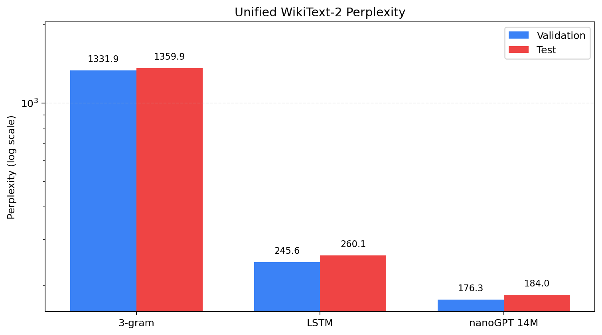
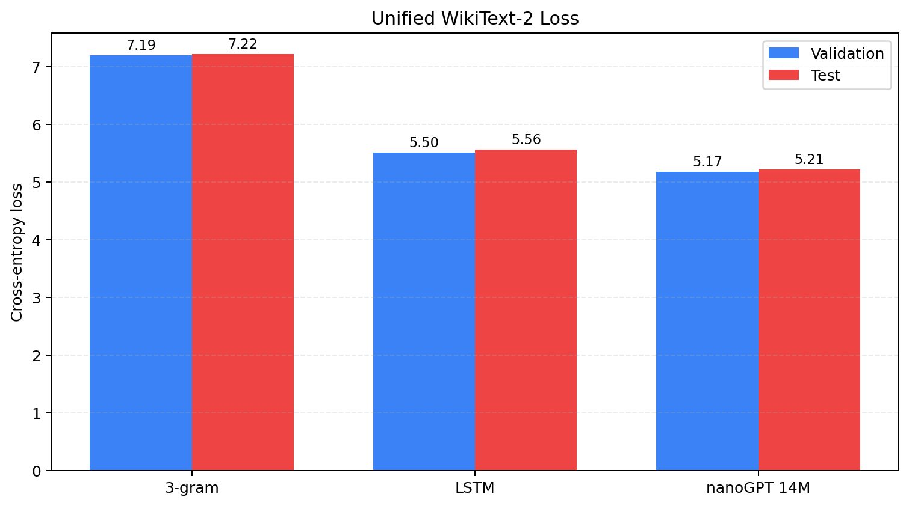
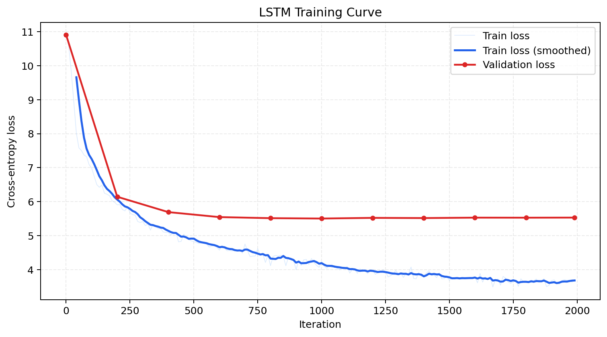

# Task A Report: Unified Data and Baseline Comparison

> Date: 2026-06-10  
> Standard data: `data/wikitext2/{train,val,test}.bin`  
> Dataset: WikiText-2 raw v1, GPT-2 BPE

## 1. Data Fix

The project previously had multiple WikiText-2 preprocessing outputs:

| Source | Train Tokens | Val Tokens | Test Tokens | Issue |
|---|---:|---:|---:|---|
| `LSTM_baseline/data/wikitext2` | 2,415,651 | 249,750 | 286,178 | Adds GPT-2 EOT tokens per non-empty document |
| `ngram/wikitext2` | 2,428,601 | 251,048 | 287,644 | Joins HF rows with `\n\n` |
| `nanogpt/data/wikitext2` | 2,391,884 | 247,289 | 283,287 | Former project standard location |
| `data/wikitext2` | 2,391,884 | 247,289 | 283,287 | Current shared project-standard location |

Task A now uses `data/wikitext2` as the single source of truth. The LSTM config has been updated so training defaults to this shared data path:

```text
LSTM_baseline/src/config_lstm.py
data_dir = "../data/wikitext2"
```

## 2. Re-run Commands

LSTM was retrained on the unified data:

```bash
cd LSTM_baseline
../nanogpt/.venv/bin/python src/lstm.py --config=src/config_lstm.py
```

Unified evaluation was then rerun for all three baselines:

```bash
nanogpt/.venv/bin/python eval/eval_lm.py --model ngram --output eval/results_ngram_unified.json
nanogpt/.venv/bin/python eval/eval_lm.py --model lstm --checkpoint LSTM_baseline/out/ckpt_best.pt --device cuda --batch_size 64 --output eval/results_lstm_unified.json
nanogpt/.venv/bin/python eval/eval_lm.py --model nanogpt --checkpoint nanogpt/out-wikitext2-14m/ckpt.pt --device cuda --batch_size 4 --output eval/results_nanogpt14m_unified.json
```

Fixed-prompt samples and figures were regenerated:

```bash
nanogpt/.venv/bin/python eval/generate_samples.py --device cuda --max_new_tokens 60
nanogpt/.venv/bin/python eval/plot_results.py
```

## 3. Unified Results

| Model | Params | Val Loss ↓ | Val PPL ↓ | Test Loss ↓ | Test PPL ↓ |
|---|---:|---:|---:|---:|---:|
| 3-gram | - | 7.1944 | 1331.93 | 7.2151 | 1359.86 |
| LSTM | 13.92M | 5.5037 | 245.59 | 5.5611 | 260.11 |
| nanoGPT 14M | 14.28M | 5.1721 | 176.29 | 5.2149 | 183.99 |

Compared with the retrained LSTM, nanoGPT 14M reduces validation PPL by:

```text
(245.59 - 176.29) / 245.59 = 28.2%
```

On the test split, nanoGPT 14M reduces PPL by:

```text
(260.11 - 183.99) / 260.11 = 29.3%
```

### 3.1 Figures

Perplexity comparison:



Direct file: [`eval/figures/ppl_comparison.png`](./eval/figures/ppl_comparison.png)

Cross-entropy loss comparison:



Direct file: [`eval/figures/loss_comparison.png`](./eval/figures/loss_comparison.png)

LSTM retraining curve:



Direct file: [`eval/figures/lstm_loss_curve.png`](./eval/figures/lstm_loss_curve.png)

## 4. Qualitative Samples

Generation setup:

| Item | Value |
|---|---|
| Decode | Greedy / top-1 |
| Max new tokens | 60 |
| Data | `data/wikitext2` |
| Full output | `eval/fixed_samples_unified.txt` |

### 4.1 Prompt: `The meaning of life is`

**3-gram**

```text
The meaning of life is a " a " a " a " a " a " a " a " a " a " a " a " a " a " a " a " a " a " a " a " a " a " a " a " a " a " a " a " a " a "
```

**LSTM**

```text
The meaning of life is the first time of the war . 
 = = = = = = = = = = = = = = = = = = = = = = = = = = = = = = = = = = = = = = = = = = = = = = = = = = =
```

**nanoGPT 14M**

```text
The meaning of life is a very good enough to be a good job . 
 = = = = = = 
 The marriage of marriage = = = = = 
 The marriage of marriage marriage marriage marriage marriage marriage marriage marriage marriage marriage marriage marriage marriage marriage marriage marriage marriage marriage marriage marriage marriage marriage marriage marriage marriage marriage
```

### 4.2 Prompt: `In the beginning`

**3-gram**

```text
In the beginning of the first time , and the first time , and the first time , and the first time , and the first time , and the first time , and the first time , and the first time , and the first time , and the first time , and the first time , and the first time ,
```

**LSTM**

```text
In the beginning of the war . 
 = = = = = = = = = = = = = = = = = = = = = = = = = = = = = = = = = = = = = = = = = = = = = = = = = = = = = =
```

**nanoGPT 14M**

```text
In the beginning of the war , the war was held in the war . 
 = = = = World War II = = = 
 The war was the first war in the war , and the war was held in the war . The war was held in the war , and the war was held in the
```

### 4.3 Prompt: `The history of the United States`

**3-gram**

```text
The history of the United States , and the first time , and the first time , and the first time , and the first time , and the first time , and the first time , and the first time , and the first time , and the first time , and the first time , and the first time , and the first time
```

**LSTM**

```text
The history of the United States , and the first time of the American Civil War . 
 = = = = = = = = = = = = = = = = = = = = = = = = = = = = = = = = = = = = = = = = = = = = = = =
```

**nanoGPT 14M**

```text
The history of the United States , and the United States . 
 = = = Background = = 
 The United States entered the United States in the United States , and was a United States Navy vessel named in the United States . The United States entered the United States in the United States . The United States entered the United States
```

Qualitatively, all three models still show repetition because WikiText-2 is small. The 3-gram baseline collapses into short local loops fastest. LSTM captures WikiText-style headings and topic words but frequently repeats separator patterns. nanoGPT produces more document-like structure, though it still repeats common entities and section templates.

## 5. Deliverables

| Deliverable | File |
|---|---|
| Shared data folder | `data/wikitext2/` |
| Shared data preparation script | `data/wikitext2/prepare.py` |
| Unified evaluation script | `eval/eval_lm.py` |
| Unified metrics | `eval/results_*_unified.json` |
| Fixed-prompt samples | `eval/fixed_samples_unified.{json,txt}` |
| Figures | `eval/figures/{ppl_comparison,loss_comparison,lstm_loss_curve}.png` |
| Main baseline report | `BASELINE_COMPARISON.md` |
| LSTM retrained checkpoint | `LSTM_baseline/out/ckpt_best.pt` |

## 6. Short Conclusion

After fixing the data mismatch, the final ordering remains:

```text
nanoGPT 14M < LSTM < 3-gram
```

where lower loss/PPL is better. The corrected comparison is stronger than the old LSTM-vs-nanoGPT claim in one important way: both neural baselines are now trained and evaluated against the same WikiText-2 token stream. nanoGPT keeps a clear advantage over the parameter-matched LSTM, reducing validation perplexity by about 28.2% and test perplexity by about 29.3%.
