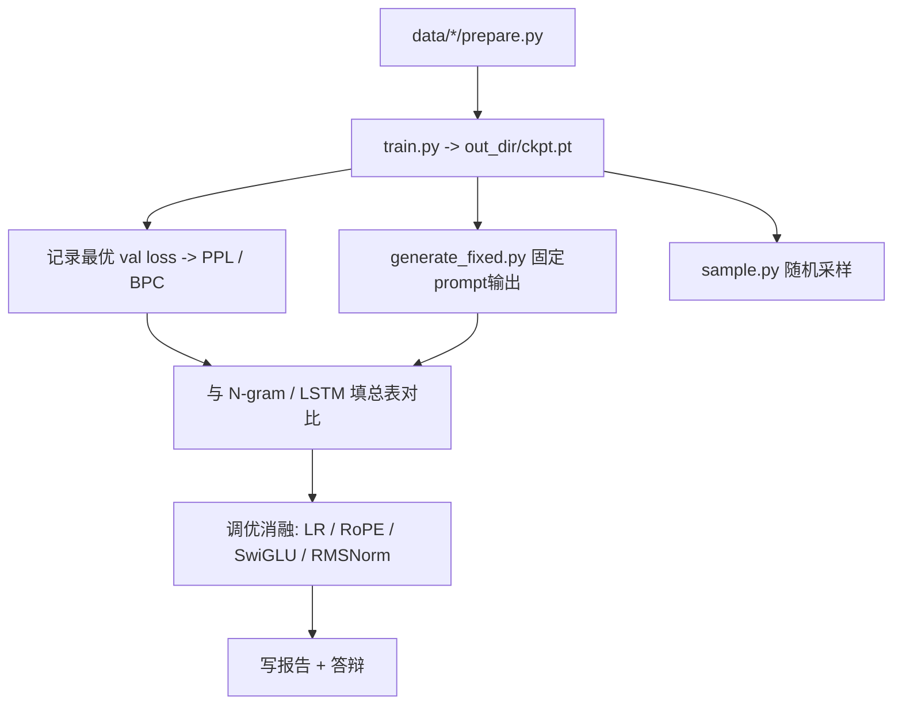

# nanoGPT 复现项目交接文档

> 生成时间：2026-06-08  
> 用途：将项目迁移到有 GPU 的电脑时，保留当前进度、配置、训练记录与后续步骤。  
> 角色：CS182 课程项目 —— 成员 C（nanoGPT 复现 + 调优）

---

## 1. 项目定位

- **复现目标**：从零干净实现 Karpathy nanoGPT（GPT-2 架构），结构对齐、代码自写。
- **核心贡献**：不是复现 GPT-2 124M 完整训练，而是在可控规模上做**系统化调优 + 量化对比**。
- **主数据集（三方对比）**：WikiText-2（`wikitext-2-raw-v1`）+ GPT-2 BPE。
- **快速调试数据集**：字符级 Tiny Shakespeare（不进主对比表，仅跑通流程）。

---

## 2. 当前机器环境（迁移前）

| 项目 | 状态 |
|---|---|
| 操作系统 | Windows 10 (10.0.22631) |
| Python | 3.12.9（miniconda `base` 环境） |
| PyTorch | **2.9.0+cpu**（无 CUDA） |
| GPU | 不可用 |
| 工作目录 | `D:\program_Terry\MLproject\Reproduction-of-GPT-2\nanogpt` |

**重要**：当前机器只能做 CPU debug；主线 WikiText-2 训练必须在 GPU 机器上进行。

---

## 3. 已完成的工作

### 3.1 代码结构（全部在 `nanogpt/` 文件夹）

```
nanogpt/
├── README.md                       # 使用说明
├── PROJECT_HANDOFF.md              # 本交接文档
├── requirements.txt                # 依赖列表
├── .gitignore                      # 忽略 .bin / ckpt / 缓存
├── model.py                        # GPT 模型（Flash Attention / 权重绑定 / generate）
├── train.py                        # 训练循环（AdamW + cosine LR + warmup + amp + ckpt）
├── sample.py                       # 随机采样生成
├── generate_fixed.py               # 固定 prompt + 确定性解码（三方定性对比）
├── prompts_shakespeare.txt         # 字符级固定 prompt
├── prompts_wikitext.txt            # BPE 固定 prompt
├── configurator.py                 # 命令行/配置覆盖工具
├── config/
│   ├── train_shakespeare_char.py   # ~10.65M 字符级 debug 配置
│   └── train_wikitext2.py          # ~44.64M 主线配置
└── data/
    ├── shakespeare_char/prepare.py # 已跑通
    └── wikitext2/prepare.py        # 尚未跑通（缺 datasets 包）
```

### 3.2 数据准备状态

| 数据集 | 状态 | 产物 |
|---|---|---|
| `shakespeare_char` | **已完成** | `input.txt`, `train.bin`, `val.bin`, `meta.pkl`（词表 65，train 1,003,854 tokens，val 111,540 tokens） |
| `wikitext2` | **未开始** | 需先 `pip install datasets`，再运行 `prepare.py` |

### 3.3 训练状态

#### Shakespeare 字符级（CPU 上尝试过，未完成）

最后一次完整训练命令：

```powershell
cd nanogpt
python train.py config/train_shakespeare_char.py --device=cpu --compile=False
```

**已观察到的训练日志（iter 0 ~ 20，随后 Ctrl+C 中断）：**

| 步数 | train loss | val loss | val ppl | 备注 |
|---|---|---|---|---|
| step 0 | 4.2874 | 4.2823 | 72.40 | 首次 eval（CPU 上 step 0 评估约 **13 分钟**） |
| iter 10 | — | — | — | loss 3.1338，每步约 **19 秒** |
| iter 20 | — | — | — | loss 2.7556，每步约 **21 秒** |

- 训练在 **iter ~20** 被手动中断（`KeyboardInterrupt`）。
- `eval_interval=250`，中断前**未达到保存 checkpoint 的条件**（`always_save_checkpoint=False`，且 `iter_num=0` 时也不保存）。
- **结论：当前没有可用的正式训练 checkpoint，需在 GPU 机器上重新训练。**

#### 更早的 smoke test（仅供参考）

- 曾用极小模型（`n_layer=2, n_head=2, n_embd=64`，0.10M 参数）跑通 20 步，验证流程可用。
- 该测试 checkpoint 已清理，与当前 10.65M 配置无关。

### 3.4 已修复的问题

| 问题 | 修复 |
|---|---|
| Windows GBK 读取 `configurator.py` 报 `UnicodeDecodeError` | `train.py` / `sample.py` 改为 `open(..., encoding="utf-8")` |
| 在仓库根目录运行脚本找不到 `data/` | 必须在 `nanogpt/` 目录下运行 |
| 把中文说明粘贴进 PowerShell 报错 | 只粘贴 `python ...` 命令，不要粘贴说明文字 |

### 3.5 尚未实现（按计划留作后续）

- 统一 PPL/BPC 评测脚本（`eval/eval_lm.py`，在 `test.bin` 上评测）
- 架构消融开关（RoPE / SwiGLU / RMSNorm）
- WikiText-2 主线正式训练
- 多种子实验、scaling 曲线、报告图表

---

## 4. 模型参数量

| 配置 | 结构 | 参数量 | 用途 |
|---|---|---|---|
| `train_shakespeare_char.py` | n_layer=6, n_head=6, n_embd=384, block_size=256, vocab=65 | **10.65M** | debug / 跑通流程 |
| `train_wikitext2.py` | n_layer=6, n_head=8, n_embd=512, block_size=512, vocab=50304 | **44.64M** | 主线对比（推荐在 GPU 上训练） |

---

## 5. 配置详情

### 5.1 Shakespeare 字符级（`config/train_shakespeare_char.py`）

```python
out_dir = "out-shakespeare-char"
dataset = "shakespeare_char"
batch_size = 64
block_size = 256
gradient_accumulation_steps = 1
n_layer = 6; n_head = 6; n_embd = 384; dropout = 0.2
learning_rate = 1e-3; max_iters = 5000; warmup_iters = 100
eval_interval = 250; eval_iters = 200
```

每步 token 数 = 64 × 256 × 1 = **16,384**

### 5.2 WikiText-2 主线（`config/train_wikitext2.py`）

```python
out_dir = "out-wikitext2"
dataset = "wikitext2"
batch_size = 12
block_size = 512
gradient_accumulation_steps = 8
n_layer = 6; n_head = 8; n_embd = 512; dropout = 0.1; bias = False
learning_rate = 6e-4; max_iters = 20000; warmup_iters = 500
eval_interval = 250; eval_iters = 100
```

每步 token 数 = 12 × 512 × 8 = **49,152**

---

## 6. CPU vs GPU 差距（已验证认知）

| 维度 | CPU | GPU |
|---|---|---|
| 模型质量 | 相同算法，收敛结果基本一致 | 相同 |
| 训练速度 | Shakespeare 每步 ~20s；step 0 eval ~13min | 预计快 **几十到上百倍** |
| 混合精度 | float32（autocast 关闭） | bf16/fp16 自动启用 |
| 适用场景 | 仅 debug / smoke test | 主线 WikiText-2 正式训练 |

---

## 7. GPU 机器迁移清单

### 7.1 需要拷贝的文件

拷贝整个仓库，至少包含：

```
Reproduction-of-GPT-2/
├── README.md              # 课程项目总方案
└── nanogpt/               # 全部复现代码（本文件夹）
    ├── data/shakespeare_char/   # 已生成的 .bin / meta.pkl 可带上，也可在新机器重新 prepare
    └── ...（其余源码）
```

**不必拷贝**（可在新机器重新生成）：

- `__pycache__/`
- `out-*/`（checkpoint 输出目录，当前无可用正式 ckpt）
- 可选：`data/**/*.bin`（体积较大，可重新 `prepare.py`）

### 7.2 新机器环境搭建

```powershell
cd nanogpt
pip install -r requirements.txt
```

安装 **CUDA 版 PyTorch**（按 GPU 的 CUDA 版本选择，示例）：

```powershell
# 到 https://pytorch.org 查对应命令，例如 CUDA 12.x：
pip install torch --index-url https://download.pytorch.org/whl/cu124
```

验证 GPU：

```powershell
python -c "import torch; print(torch.__version__, torch.cuda.is_available(), torch.cuda.get_device_name(0) if torch.cuda.is_available() else 'no gpu')"
```

### 7.3 推荐训练顺序（GPU 机器）

**Step 1：快速验证流程（可选，几分钟）**

```powershell
cd nanogpt
python data/shakespeare_char/prepare.py
python train.py config/train_shakespeare_char.py --compile=False
```

Windows 若 `torch.compile` 报错，始终加 `--compile=False`。

**Step 2：主线训练（项目核心）**

```powershell
pip install datasets tiktoken transformers
cd ..
python data/wikitext2/prepare.py
cd nanogpt
python train.py config/train_wikitext2.py --compile=False
```

显存不足时的旋钮（命令行覆盖）：

```powershell
python train.py config/train_wikitext2.py --compile=False --batch_size=8 --gradient_accumulation_steps=12 --block_size=256
```

**Step 3：训练完成后**

```powershell
# 随机采样
python sample.py --out_dir=out-wikitext2 --start="The meaning of life is"

# 固定 prompt 确定性输出（与 N-gram/LSTM 对比用）
python generate_fixed.py --out_dir=out-wikitext2 --prompts_file=prompts_wikitext.txt
```

### 7.4 指标记录

训练日志中的最优 `val loss` 可直接换算：

- `PPL = exp(val_loss)`
- `BPC = val_loss / ln(2)`

填入课程 README 第 4.6 节结果总表的 nanoGPT 行。

---

## 8. 训练后完整工作流



---

## 9. 对话中达成的关键决策（防丢失）

1. **复现范围**：仅核心复现（model / train / sample / data / config），架构改进与评测脚本后续再加。
2. **代码来源**：从零干净自写，结构对齐 nanoGPT，非直接 clone 官方仓库。
3. **文件夹**：全部复现代码集中在 `nanogpt/`。
4. **定性对比**：新增 `generate_fixed.py`，用固定 prompt + 贪心解码 + 固定种子，输出 `.txt` + `.json`，供三方同台对比。
5. **Shakespeare**：仅 debug 层，不进主对比表；主线必须是 WikiText-2 + GPT-2 BPE。

---

## 10. 常见问题速查

| 现象 | 原因 | 处理 |
|---|---|---|
| 初始化后长时间无输出 | CPU 上 step 0 要做 200 次 eval | 等待，或 `--eval_iters=20` |
| `No module named 'datasets'` | 未安装依赖 | `pip install -r requirements.txt` |
| `can't open file data/...` | 不在 `nanogpt/` 目录 | 先 `cd nanogpt` |
| `torch.compile` 报错 | Windows 不支持 | 加 `--compile=False` |
| PowerShell 中文命令报错 | 误粘贴了说明文字 | 只执行 `python ...` 行 |
| 无 checkpoint | `eval_interval=250` 且训练步数不够 | 继续训练到 250+ 步，或 `--always_save_checkpoint=True` |

---

## 11. 下一步优先级（GPU 机器上）

1. 安装 CUDA 版 torch + `pip install -r requirements.txt`
2. `cd .. && python data/wikitext2/prepare.py && cd nanogpt`
3. `python train.py config/train_wikitext2.py --compile=False`（主线正式训练）
4. 记录最优 val loss / PPL / BPC
5. `python generate_fixed.py --out_dir=out-wikitext2 --prompts_file=prompts_wikitext.txt`
6. （可选）补 `eval/eval_lm.py` 统一评测脚本
7. （可选）做 RoPE / SwiGLU / RMSNorm 消融实验

---

*本文档随项目一并迁移，无需依赖 Cursor 对话记录。*
